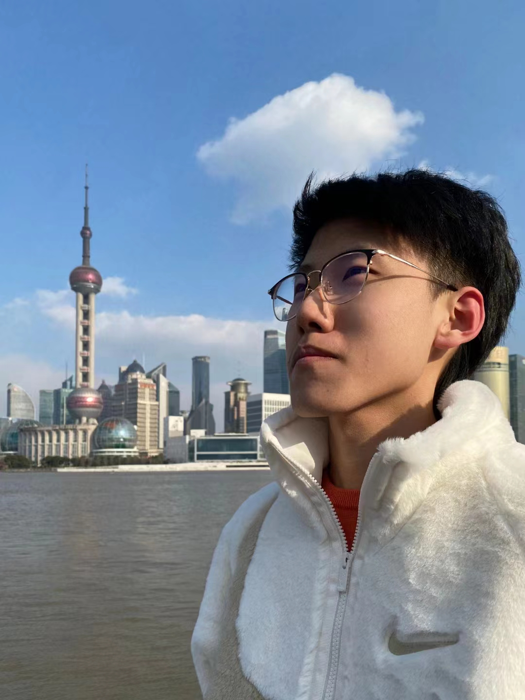

# About Me

Here is **Ducheng Jin (Servant, 金督程)**.

I am a junior majoring in **Electrical & Computer Engineering** at Harbin Institute of Technology (China). I am extremely fortunate to be advised by [Yushi Chen](http://homepage.hit.edu.cn/chenyushi). Here is [my Resume]().

## Research Interests

1. **Computer Vision**: 

   Focusing on modeling and application, currently working on the hyperspectral imaging, with future plans to research in other aspects.

2. **Robotics**:

   Focusing on practical applications of theories. Successful works include a quadcopter, a robotic boat, and a robotic vehicle.

3. **Quantum**:

   Willing to engage in the construction of quantum algorithms and quantum hardware.

## News and Updates

- remain to be done
