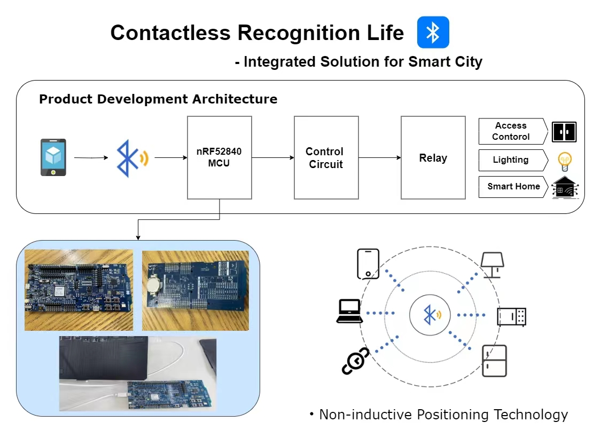

# Research Projects

P.S., click the hyperlink title to access the source. 

#### **Development of infrared camera for lunar exploration satellite**

[Ongoing]

#### **Crop pest detection and early warning system**

[Ongoing]

#### **Contactless Recognition Life - Integrated Solution for Smart City**

#### **Eagle-inspired Adaptive Strategy Quadcopter**

#### **Sky-reaching Eyes on Migratory Birds' Wings - Environmental Monitoring System**

#### **One-stop Solution for Garbage Recycling**

#### **Intelligent Environment Perception and Collaborative Algorithm-based Naval Cruise Plan**

